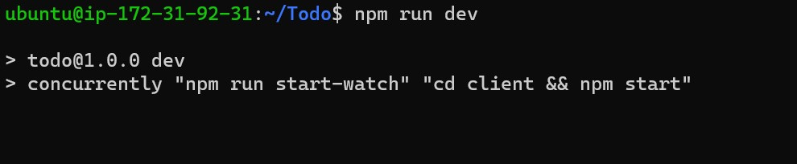

**Oluwatosin Documentation on MERN**

**Step 1 (BACKEND-CONFIG)**

`node index.js`

*MongoDB Database set successfully*

**Step 2 (FRONTEND-CONFIG)**

`npx create-react-app client`

`npm install nodemon --save-dev`

`npm run dev`

`npm install axios`

`npm run dev`

[Todo interactive Page](http://34.207.66.116:3000/)

